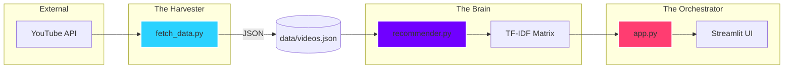

# 🤖 System Agents & Intelligence Report

## 🌌 Overview
The **YouTube Analytics Engine** is architected as a multi-agent system where specialized logic modules (Agents) collaborate to transform raw YouTube API data into actionable editorial intelligence.

---

## 🕵️ The Agents

### 1. 🚜 The Harvester (`fetch_data.py`)
*   **Role**: Data Extraction Agent
*   **Responsibility**: Parallelized scraping of the YouTube Data API v3.
*   **Core Intelligence**:
    *   **Parallel Execution**: Uses 12 concurrent threads to bypass latency.
    *   **Heuristic Classification**: Automatically identifies if a video is a **Short**, **Live stream**, or **Standard Video** based on duration and metadata.
    *   **Quota Optimization**: Batches requests in groups of 50 to minimize API cost.

### 2. 🧠 The Brain (`recommender.py`)
*   **Role**: AI & Analysis Agent
*   **Responsibility**: Content relationships, trending calculations, and semantic matching.
*   **Core Intelligence**:
    *   **TF-IDF Vectorizer**: Creates a mathematical signature for every video.
    *   **Cosine Similarity Engine**: Identifies "Topic Neighbors" to power the Coverage Race.
    *   **Hybrid Scorer**: Weighs Velocity (VPH) against Engagement Quality to detect real-time virality.

### 3. 🎭 The Orchestrator (`app.py`)
*   **Role**: UI & Coordination Agent
*   **Responsibility**: User interaction, authentication, and state management.
*   **Core Intelligence**:
    *   **State Persistence**: Manages session data and multi-tab filtering.
    *   **Render Engine**: Injects custom CSS and Mermaid graphs for a premium experience.
    *   **Security Barrier**: Handles Private Key validation and access control.

---

## 🗺 Project Base Structure

```text
Youtube/
├── 📄 app.py              # The Orchestrator (Main UI)
├── 📄 config.py           # The Vault (Global Settings & API Keys)
├── 📄 fetch_data.py       # The Harvester (Parallel Scraper)
├── 📄 recommender.py      # The Brain (AI Engine)
├── 📄 requirements.txt    # Dependency Matrix
├── 📄 Procfile            # Deployment Instruction (Render)
├── 📄 render.yaml         # Cloud Infrastructure Blueprint
├── 📁 .streamlit/         # UI Configuration
│   └── config.toml        # Server & Theme Settings
├── 📁 data/               # Persistent Intelligence Vault
│   ├── videos.json        # Raw Video Lake
│   ├── videos.csv         # Structured Export
│   └── recommendations.json # Computed Graph Data
└── 📁 documentation/      # Knowledge Base
    ├── DEPLOYMENT.md      # Cloud Hosting Guide
    ├── PROJECT_DETAILS.md # Technical Deep-Dive
    └── AGENTS.md          # System Agent Mapping
```

---

## 📈 Graphify Output (System Relationships)

### God Nodes (High Centrality)
1.  `RecommendationEngine` - 18 connections (The central hub for all analysis).
2.  `fetch_all_channels()` - 12 connections (The entry point for data).
3.  `render_video_card()` - 8 connections (The primary UI component).

### System Graph


---

## 🔍 Community Clusters
*   **Intelligence Community**: `recommender.py`, `TF-IDF`, `CosineSimilarity`.
*   **Interface Community**: `app.py`, `CSS Engine`, `StatCards`.
*   **Persistence Community**: `data/`, `config.py`, `OS Environment`.
