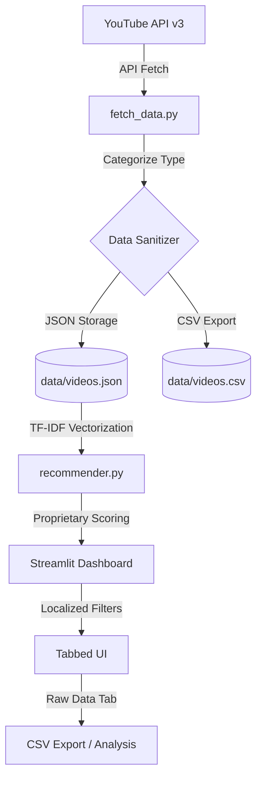

# 📑 YouTube Recommendation System: Comprehensive Technical Documentation

## 1. Project Overview
This project is an advanced, AI-powered analytics and competitive benchmarking engine designed for high-frequency YouTube content tracking. It focuses on large-scale news broadcasting networks, enabling editorial teams to identify viral trends, audit SEO strategies, and benchmark performance across competitors in real-time.

The system integrates the **YouTube Data API v3** with a custom analytical pipeline that transforms raw metadata into actionable intelligence using proprietary scoring algorithms.

---

## 2. Platform Modules (Tabs)
The application is structured into five core analytical modules, each featuring **Localized Control Panels** for independent filtering:

1.  **📊 Dashboard**: The executive summary view. Features real-time stat cards and the top 50 viral trends across the entire tracked network.
2.  **🔥 Trending**: A specialized deep-dive into viral content. Allows users to sort by velocity (Views/Hr), trending scores, or engagement intensity.
3.  **🔍 Search**: AI-powered semantic search. Uses **TF-IDF (Term Frequency-Inverse Document Frequency)** to find relevant content across titles, descriptions, and tags, supported by metadata filters.
4.  **🏁 Coverage Race**: A competitive speed-tracking tool for breaking news. It identifies the "First Responder" for any given topic and calculates the editorial "latency" of competitors in minutes.
5.  **📊 Raw Data Explorer**: A high-fidelity data grid. Provides a complete table of every video in the current dataset with all metrics, full tag lists, direct watch links, and **CSV Export** functionality.

---

## 3. Metrics & Key Performance Indicators (KPIs)
The system calculates complex indicators to provide a deeper understanding of content performance beyond raw views.

| Metric | API Key | Logic / Calculation | Description | Primary Use Case |
| :--- | :--- | :--- | :--- | :--- |
| **Engagement Rate** | `engagement_rate` | `((Likes + Comments) / Views) * 100` | Measures interaction quality relative to audience size. | Identifying "sticky" content that resonates deeply. |
| **Velocity (VPH)** | `velocity` | `Total Views / max(1, AgeHours)` | The real-time "speed" of the video. | Catching viral spikes in breaking news. |
| **Engagement Score** | `eng_score` | `log10(v)*0.4 + log10(l)*0.35 + log10(c)*0.25` | A 0-1 normalized score representing interaction intensity. | Ranking high-quality vs. clickbait content. |
| **Freshness Score** | `fresh_score` | `Stepped Decay (1.0 to 0.1)` | Rewards new content. 1.0 for <6h, decays over 30 days. | Prioritizing same-day news in recommendations. |
| **Trend Score** | `trend_score` | `(log10(vph+1)/5)*0.6 + EngScore*0.4` | Our proprietary ranking score for the **Trending** tab. | Automated selection of "Top Story" candidates. |
| **Match Score** | `search_score` | `CosineSimilarity(Vec_q, Vec_d)` | Semantic relevance score for search results. | AI-driven archive search for historical themes. |
| **Time Gap** | `gap` | `t_current - t_first` | Minutes/Hours delay relative to the first reporter. | Editorial accountability and speed benchmarking. |

---

## 4. Analytical Formulas & Logic

### A. The Velocity Factor (**Velocity (VPH)**)
To distinguish between an old video with many views and a new video gaining traction fast, we use **Velocity (VPH)** (Views Per Hour):
> $$VPH = \frac{\text{Total Views}}{\max(1, \text{Hours Since Published})}$$
*Note: Denominator is capped at 1 to prevent division by zero or extreme spikes in the first few minutes.*

### B. Hybrid **Trend Score** Algorithm
The system prioritizes content that is both fast-growing and high-quality:
> $$Score_{Trend} = (NormalizedVPH \times 0.6) + (EngScore \times 0.4)$$
*Normalization is performed using `log10` to ensure that viral hits don't mathematically overshadow steady performance.*

### C. Semantic Relevance (TF-IDF)
The Search module uses a Vector Space Model:
1.  **Term Frequency**: How often a keyword appears in a specific video's metadata.
2.  **Inverse Document Frequency**: How "rare" or "important" a keyword is across the whole dataset.
3.  **Cosine Similarity**: Measures the angle between the user's query vector and the video's document vector.

---

## 5. Content Classification
The engine automatically categorizes content for format-specific benchmarking:
- **🔴 Live**: Content currently broadcasting or a VOD of a live stream.
- **🟣 Short**: Short-form content ($\le 60$ seconds).
- **⚪ Video**: Standard long-form content.

---

## 6. System Architecture & Data Flow

---

## 7. Operational Workflow
- **Extraction**: `fetch_data.py` retrieves 20+ metrics including view counts, durations, and broadcast statuses.
- **Storage**: Highly optimized JSON for engine processing and matching CSV for external data science work.
- **Reporting**: The `app.py` dashboard uses **Localized Filters**, meaning you can set different date ranges for the Dashboard and Search tabs simultaneously.

---

## 8. Strategic Use Cases

### A. Breaking News Velocity Tracking
**Scenario**: A major political event occurs.  
**Use Case**: Editorial teams use the **Trending** tab sorted by **Velocity (VPH)** to identify which specific clips or live streams are gaining the most momentum in the first 60 minutes. This allows them to pivot social media promotion toward the highest-velocity assets.

### B. Competitor Editorial Audit
**Scenario**: Benchmarking performance against rival news channels.  
**Use Case**: Using the **Coverage Race**, a Lead Producer can see that their channel was 45 minutes late to a "Budget 2024" story compared to a competitor. They can then use the **Raw Data Explorer** to see if the competitor used specific high-performance tags or a different video format (e.g., a Short vs a Standard Video) to "break" the story first.

### C. SEO & Metadata Optimization
**Scenario**: Optimizing click-through rates and search visibility.  
**Use Case**: Digital teams export the **Raw Data** to CSV and analyze the **Tags** and **Description** length of videos with the highest **Engagement Score**. They can identify which keywords are currently "weighting" highest in the market and update their own metadata accordingly.

### D. Format-Specific Performance Benchmarking
**Scenario**: Deciding whether to invest more in YouTube Shorts or Live streams.  
**Use Case**: By using the **Video Type** filter across all tabs, analysts can compare the average **Engagement Rate** of Shorts vs. Standard Videos. If Shorts show a 3x higher **Engagement Score**, the network may shift its production strategy toward short-form content.

### E. AI-Powered Topic Evolution
**Scenario**: Reviewing how a historical topic (e.g., "Elections") was covered over the last 30 days.  
**Use Case**: Using the **Search** module with a localized **Date Range**, editorial teams can see the **Match Score** for different sub-topics, helping them understand which angles of a story resonated best with the audience over time.

---

## 9. Validation & Test Cases

### TC-01: Data Pipeline Integrity
- **Objective**: Ensure `fetch_data.py` retrieves all 20+ requested metrics.
- **Action**: Run `python fetch_data.py` with a valid API key.
- **Expected Result**: `data/videos.json` and `data/videos.csv` are populated with non-zero values for views, likes, and published dates.

### TC-02: Algorithm Accuracy (VPH)
- **Objective**: Validate the Velocity calculation.
- **Action**: Manually calculate `views / age` for a video published 10 hours ago with 10k views.
- **Expected Result**: Dashboard displays `1000 VPH` for that record.

### TC-03: Search Semantic Matching
- **Objective**: Test TF-IDF vectorization.
- **Action**: Search for "Budget" in the **Search** tab.
- **Expected Result**: Results include videos containing "Budget", "Finance", or "Tax" in tags, even if not in the main title.

### TC-04: Coverage Race Time-Stamp Logic
- **Objective**: Verify chronological "Story Breaking" calculation.
- **Action**: Search for a common keyword (e.g., "PM Modi").
- **Expected Result**: The fastest channel shows `🚀 First!`, and subsequent channels show the correct minute delay (e.g., `+12 min late`).

### TC-05: Localized Filter Independence
- **Objective**: Ensure the newly implemented Localized Controls work individually.
- **Action**: Set **Dashboard** to "Last 2 Days" and **Search** to "Last 15 Days".
- **Expected Result**: Switching tabs maintains the selected date range for each specific view without crosstalk.

---

## 10. Technical Stack & Dependencies

| Layer | Technology | Purpose |
| :--- | :--- | :--- |
| **Frontend** | Streamlit | Rapid UI development and interactive data state management. |
| **Logic Engine** | Python 3.11+ | Core processing, data scraping, and mathematical modeling. |
| **Data Engine** | Scikit-Learn | Vectorization (TF-IDF) and similarity calculations. |
| **Data API** | YouTube Data v3 | Primary source for global video performance metadata. |
| **Storage** | Flat-File (JSON/CSV) | High-speed local caching without database overhead. |
| **Styling** | Vanilla CSS3 | Custom Glassmorphism and animations for a premium UX. |

---

## 11. Admin & Configuration Guide

### Adding New Channels
1. Open `config.py`.
2. Locate the `CHANNEL_IDS` dictionary.
3. Add a new key-value pair: `"channel_name": "UC_CHANNEL_ID_HERE"`.
4. Restart the app and click **"Fetch Fresh Data"**.

### Adjusting Data Depth
- **Time Window**: Change `DAYS_BACK` in `config.py` to pull deeper historical data.
- **Scraping Limit**: Update `MAX_RESULTS_PER_CHANNEL` in `fetch_data.py` (default: 2500).

---

## 12. Strategic Roadmap

- [ ] **AI Summarization**: Integrating LLMs to summarize top 10 trending news videos automatically.
- [ ] **Sentiment Analysis**: Tracking audience comment sentiment (Positive/Neutral/Negative) in real-time.
- [ ] **Automated Alerts**: Email/Slack notifications when a competitor breaks a story first.
- [ ] **Predictive Virality**: Machine learning model to predict which videos will cross 1M views based on first-hour velocity.

---

## 13. FAQ & Troubleshooting

**Q: Why are some videos missing from the Search results?**  
*A: The system uses localized date filters. Ensure your "Date Range" in the Search tab expander includes the publication date of the video you are looking for.*

**Q: How do I update the view counts for today?**  
*A: Click the **"Fetch Fresh Data"** button in the sidebar. This clears the cache and performs a fresh API sync.*

**Q: The Coverage Race shows "No videos found".**  
*A: Check your topic keyword. Try broader terms (e.g., use "Modi" instead of "Prime Minister Narendra Modi Visit"). Also, verify the date range includes the event date.*

---
*Last Updated: 2026-04-15*  
*Proprietary Analytical Framework developed for high-frequency video competitive tracking.*
