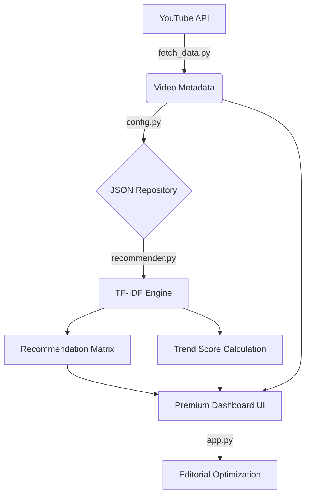

# YouTube Analytics Engine - AI Recommendation Suite



---

## 🎯 Project Overview

**YouTube Analytics Engine** is a professional-grade video intelligence dashboard designed to monitor and analyze YouTube content across major news and media channels. It leverages custom **AI Recommendation Logic** to identify viral trends, content similarities, and editorial gaps in the YouTube ecosystem.

Unlike standard YouTube Studio metrics, this suite provides **Velocity-based Trending (VPH)** and **Cross-Channel Coverage Analysis**, allowing editorial teams to see who broke a story first on YouTube.

---

## 💎 Design Philosophy: Cinematic Intelligence

The UI is built with a **"Premium Video Wall"** aesthetic:
- **Neon Glassmorphism**: Cards use translucent backdrops with animated glow borders for high-impact visual hierarchy.
- **Micro-Animations**: Uses `@keyframes` for smooth fade-ins and pulse effects on trending badges.
- **Dynamic Badges**: Color-coded badges for VPH, Engagement, and Match scores allow for rapid data scanning.
- **Adaptive Grid**: A fluid 3-column layout that scales perfectly from desktop command centers to tablet viewports.

---

## 🎥 Core Intelligence Modules

### 1. 🔥 Viral Dashboard
**Focus**: *High-Velocity Growth*
- **Trend Score**: A custom hybrid metric combining Velocity (60%) and Engagement Quality (40%).
- **Velocity Tracking (VPH)**: Real-time views-per-hour calculation to identify what is exploding *now*, not just what has the most total views.
- **Viral Podium**: Ranks the top 50 most significant videos in the current dataset.

### 2. 🏁 Coverage Race (News Focus)
**Focus**: *Chronological Dominance*
- **First-to-Market Detection**: Identifies which channel uploaded a specific story first.
- **Gap Analysis**: Shows the exact time delay (minutes/hours) between the pioneer and followers.
- **Keyword Correlation**: Uses semantic matching to group videos covering the same event from different publishers.

### 3. 🧠 Smart Search
**Focus**: *Content Discovery*
- **TF-IDF Search Engine**: Moves beyond literal string matching to find videos based on semantic importance.
- **Weighted Relevance**: Scores match quality based on title density and description metadata.
- **Global Filtering**: Filter search results by channel, video type (Short vs. Longform), and date range.

### 4. 📊 Raw Data Explorer
**Focus**: *Deep Metric Auditing*
- **Vectorized Dataset**: uses `pandas` for high-performance filtering and sorting across thousands of rows.
- **Export Control**: One-click CSV export of all fetched metadata for offline reporting.
- **Engagement Analytics**: Specialized metrics for Like/Comment ratios and Freshness scores.

---

## ⚙️ Technical Architecture

### 1. AI Recommendation Engine (`recommender.py`)
- **Custom TF-IDF implementation**: Built from the ground up to avoid heavy external dependencies while maintaining high performance.
- **Cosine Similarity Sparse Matrix**: Calculates content relationships between videos to power "Similar Video" recommendations.
- **Engagement Scoring**: Log-scaled normalization of views, likes, and comments to prevent outliers from skewing the data.

### 2. Parallel Data Pipeline (`fetch_data.py`)
- **Threaded Fetching**: utilizes `ThreadPoolExecutor` with 12 concurrent workers to scrape large volumes of data from YouTube API v3 in seconds.
- **Smart Throttling**: Intelligent handling of API quotas and playlist-based discovery.

### 3. UI Framework (`app.py`)
- **Advanced CSS Engine**: Over 300 lines of custom CSS to transform Streamlit into a bespoke cinematic dashboard.
- **Session State Management**: Handles authentication and real-time data refresh cycles.

---

## 📂 Project Structure

```text
Youtube/
├── app.py              # Main UI & Dashboard Routing
├── config.py           # Channel Matrix & API Configuration
├── fetch_data.py       # Parallel API Data Pipeline
├── recommender.py      # AI Engine (TF-IDF & Scoring)
├── requirements.txt    # System Dependencies
├── data/               # Persistent Storage Vault
│   ├── videos.json            # Central Video Repository
│   └── recommendations.json   # Computed AI Relations
└── .streamlit/
    └── config.toml     # Global Cloud Hosting Config
```

---

## 🚀 Operations Guide

### Cloud Deployment
1. Push to GitHub.
2. Deploy on **Render** (see `DEPLOYMENT.md` for exact steps).
3. Set `YOUTUBE_API_KEY` in environment variables.

### Daily Workflow
1. **Sync**: Click "🚀 Fetch Fresh Data" in the sidebar to run the parallel fetcher.
2. **Review**: Analyze the **Dashboard** for viral spikes.
3. **Audit**: Use **Coverage Race** to check speed-to-market performance against competitors.
4. **Export**: Export **Raw Data** for weekly editorial performance reviews.
```
